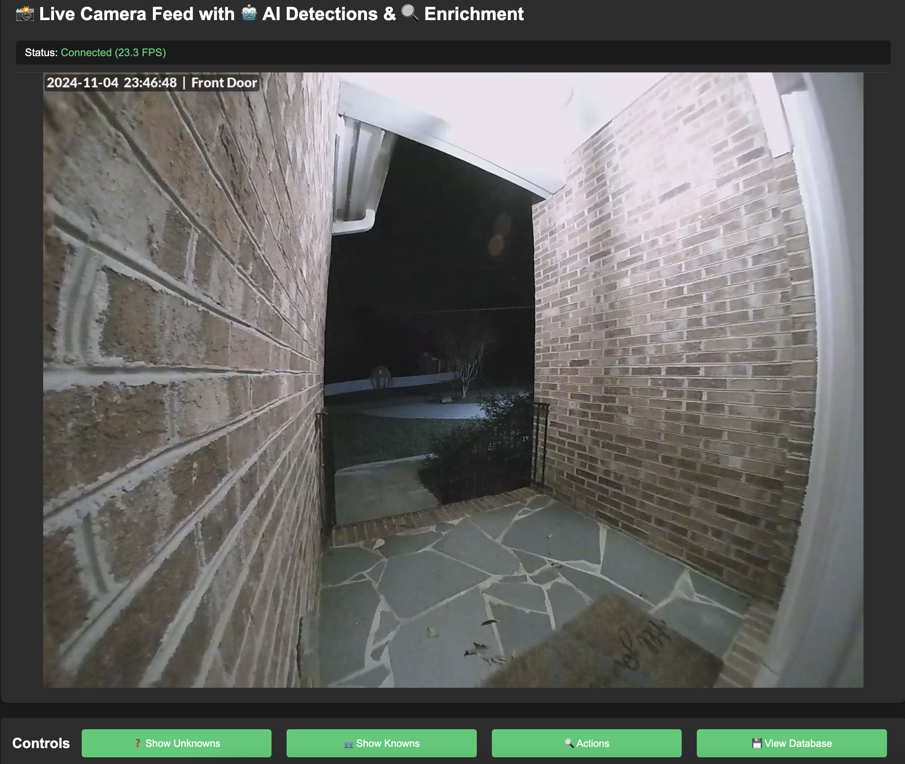
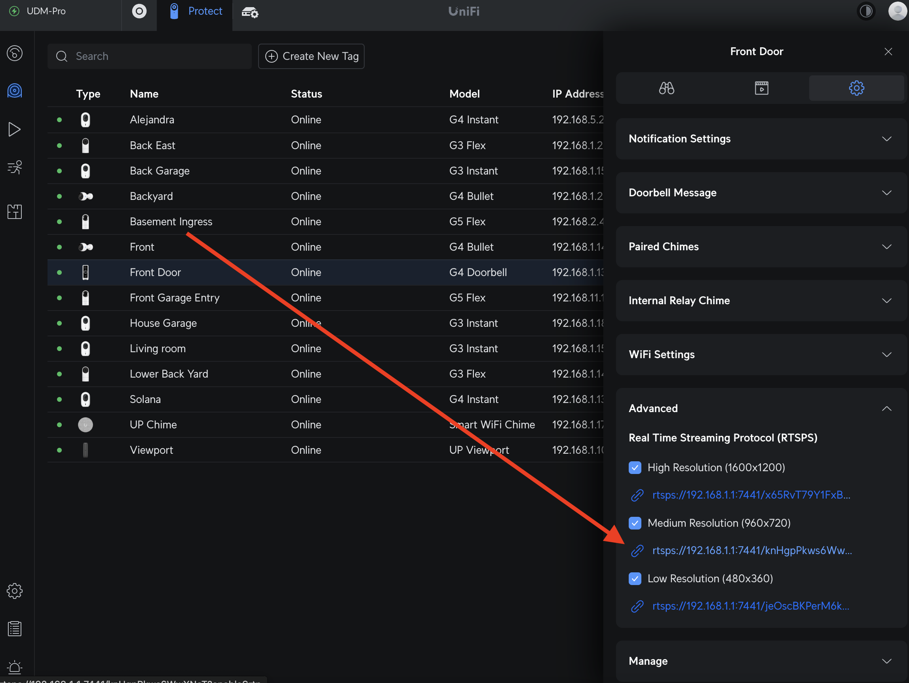
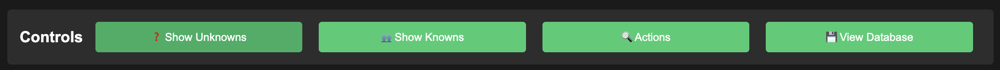
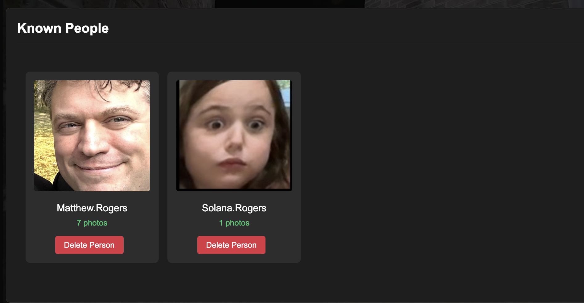
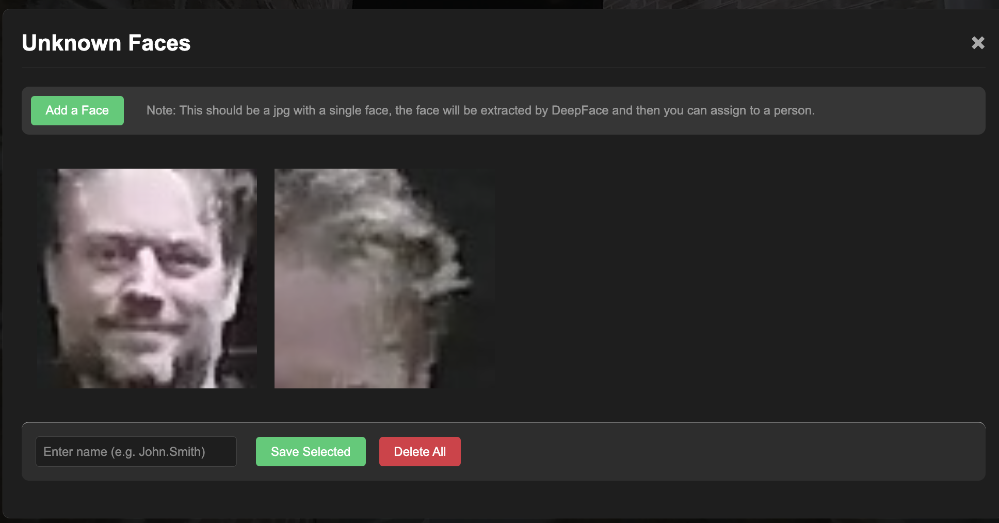
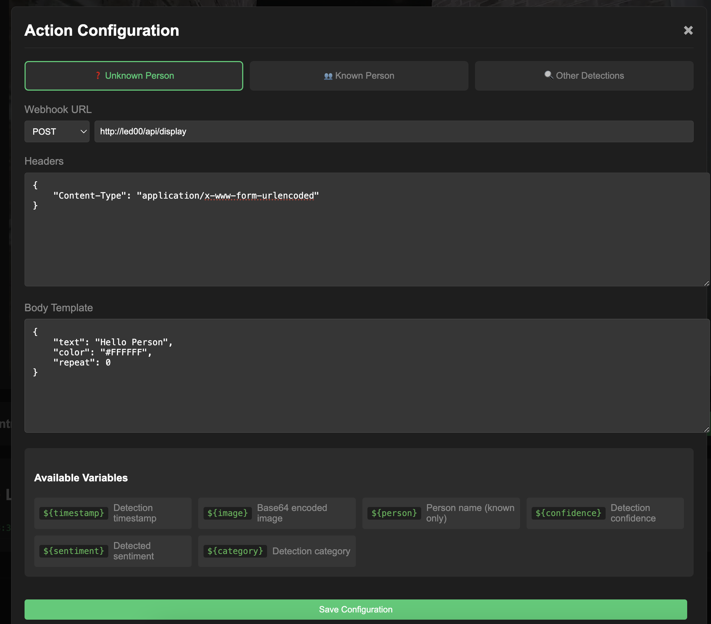
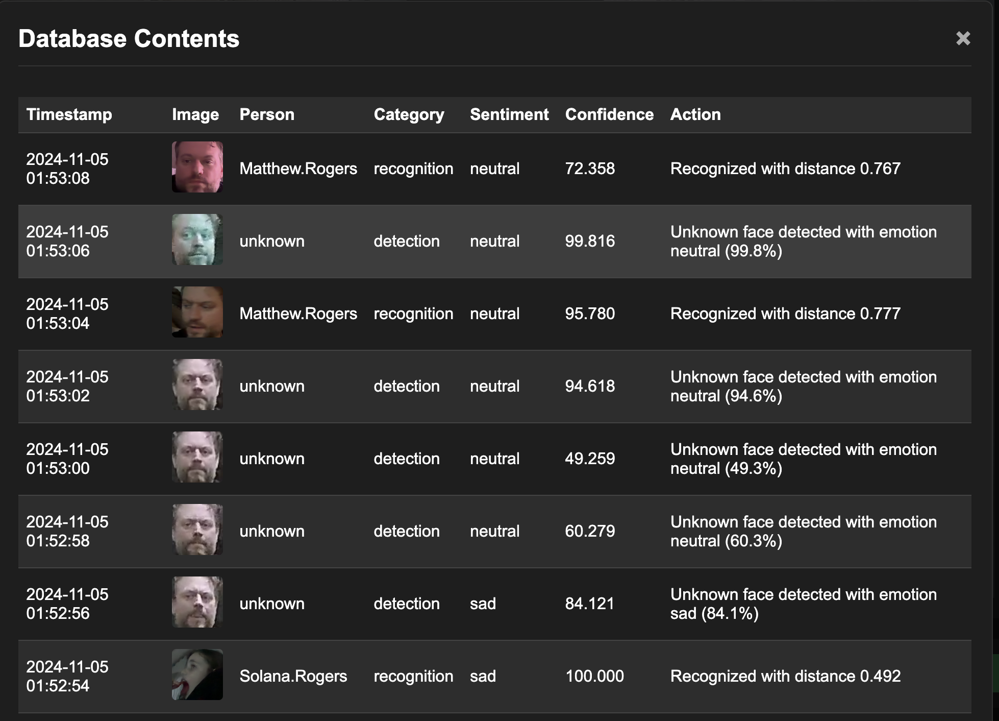

# ✨ Greeter - Welcome Home, Family! ✨

Is the person at the door a friend or a foe? Are they angry or happy? Do I know them? AI can answer these questions and more.

I wanted to create a special experience for my family and guests every time they walk through the door. So, I did what any reasonable dad would do: I built a multi-model AI pipeline 🎉 that tracks everyone’s mood when they get home and lights up an LED sign to greet them. 🤖💡 Now, each arrival feels warm, personalized, and totally unique. Welcome home, where AI meets heart! 🏡💖




# Greeter System Architecture

The system is designed to be used completely locally and does not require any internet connection when in use.  It also does not track any data about the users. The user interface is a web page that can be accessed by any modern web browser without any 3rd party identification.

# Works with Unifi Protect 🚀

Just add the RTSP stream from your Unifi Protect NVR to the .env file. That's it!


## Core Components
1. **Docker Container**
   - Single container deployment
   - GPU/MPS acceleration support
     - Performance is smart, uses YOLO for person detection and DeepFace for face recognition.
     - YOLO uses 1-3% of the GPU and is always active (limited to 2x a second)
     - DeepFace uses 10-20% of the GPU, but only runs when a new person is detected from the YOLO stream
   - Environment configuration via .env file
   - Volume mounts for known and unknown faces optional, but recommended for upgrades!

2. **Video Processing Pipeline**
   - RTSP camera stream support
   - Video file playback support
   - Real-time frame processing

3. **AI Models**
   - YOLO for person detection and extraction (CUDA and MPS supported)
   - DeepFace for face recognition (CUDA and MPS supported)
     - Facenet
       - Face verification
       - Emotion analysis
     - Retinaface
       - Face extraction

4. **Database**
   - SQLite for activity logging
   - Face recognition data
   - Person history data

## Features

Fully GUI based system.


### Person Management
1. **Known Person Recognition**
   - Face recognition for family/known individuals
   - Emotion detection
   - Activity logging
   - Customizable greetings

  

1. **Unknown Person Handling**
   - Automatic face capture
   - Classification system (delivery, maintenance, etc.)
   - Storage of unknown faces for later identification
   - Configurable alerts

  

### User Interface
1. **Web-Based Control Panel**
   - Live camera feed display
   - Activity log viewer
   - Person management interface
   - System configuration

2. **Configuration Options**
   - Camera source management (RTSP)
   - Alert preferences
   - Recognition sensitivity
   - Greeting customization

### Notifications & Integration
1. **Alert System**
   - Webhook support for notifications
   - LED display integration
   - Customizable triggers
   - Person-specific actions



### Data Management
1. **Local Database**
   - SQLite for activity logging
   - Face recognition data
   - Person profiles
   - System configuration




## Security & Privacy
1. **Data Protection**
   - Local processing only
   - Secure storage of face data
   - Configurable retention policies
   - Privacy-focused design
   - No tracking, no data collection
   - No internet connection required when in use
   - No 3rd party identification required
   - No user accounts required
   - No subscriptions required

2. **Access Control**
   - No internet connection required when in use
   - No 3rd party identification required
   - *You absolutely should put this behind some sort of access control*


## Software Setup

Clone the repository
```
git clone https://github.com/RamboRogers/greeter.git
cd greeter
```


The environment variables can be set in a .env file, or passed to the docker container at runtime.

Copy the .env.example file to .env and set the variables.
```
cp .env.example .env
nano .env
```
The best way to get the RTSP stream is to use the unifi protect web interface.

### Run Natively

Setup a python environment.
```
python3.11 -m venv .venv
source .venv/bin/activate
pip install -r requirements.txt
```

To start the program, run the following command.
```
python app.py
```

## Use Docker

Use a prebuilt image from Docker Hub.
```
docker pull mattrogers/greeter:latest
```

Download the .env file from this repository.

```
wget https://raw.githubusercontent.com/RamboRogers/greeter/master/.env.example -O .env
```

Edit the .env file with your configuration.
> You really only need to change the RTSP stream.


Run the container.
```
docker run -d \
  --gpus all \
  --env-file ./.env \
  -p 8000:8000 \
  --restart unless-stopped \
  --name greeter \
  mattrogers/greeter:latest
```

View the application locally at http://127.0.0.1:8000 or whatever IP is on your docker host.

### Scripted Build and Deploy 🚀

Clone the repository.
```
git clone https://github.com/RamboRogers/greeter.git
cd greeter
```

Execute the build script.
```
bash build_docker.sh
```

### Build and Run ☭

Build the docker image.
```
docker build -t greeter .
```


### Single Self Contained Container

```
docker run -d \
  --gpus all \
  --env-file ./.env \
  -p 8000:8000 \
  --restart unless-stopped \
  --name greeter \
  greeter
```

### Persistent Volumes

First, create the persistent volumes:
```
docker volume create greeter_known_faces
docker volume create greeter_unknown_faces
```

Nvidia GPU with persistent volumes:
```
docker run -d \
  --gpus all \
  --env-file ./.env \
  -p 8000:8000 \
  --volume greeter_known_faces:/app/known_faces \
  --volume greeter_unknown_faces:/app/unknown_faces \
  --restart unless-stopped \
  --name greeter \
  greeter
```

### Apple Silicon
For Apple Silicon, you can use the following command.
> Note: This will be slower than the GPU version.
```
docker run -d \
  --platform linux/arm64 \
  -e PYTORCH_ENABLE_MPS_FALLBACK=1 \
  -e PYTORCH_MPS_ENABLE_IF_AVAILABLE=1 \
  -p 8000:8000 \
  --restart unless-stopped \
  --env-file ./.env \
  --name greeter \
  greeter
```


## License and Contact

This project is licensed under the GNU General Public License v3.0 (GPL-3.0) - see the [LICENSE](LICENSE) file for details.

### Connect With Me
- GitHub: [RamboRogers](https://github.com/RamboRogers)
- X/Twitter: [@rogerscissp](https://x.com/rogerscissp)
- Website: [matthewrogers.org](https://matthewrogers.org)
